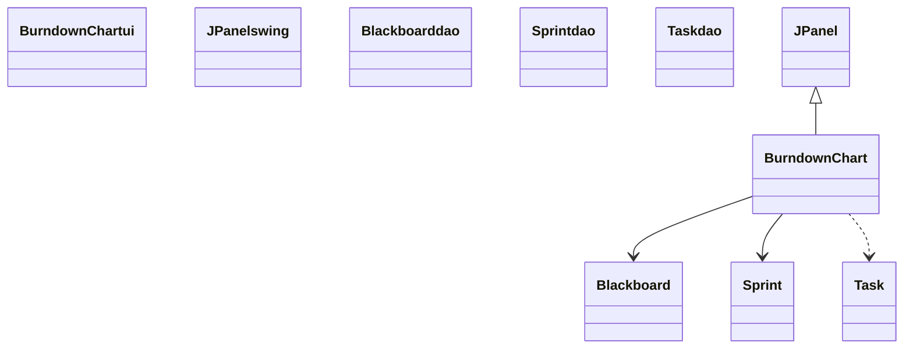

> [!NOTE]
>
> Experimenting with a class diagram created in Mermaid.

```mermaid
%%{init: {'themeVariables': {
  'fontSize': '14px',
  'nodeSpacing': 80,
  'rankSpacing': 80
}}}%%
classDiagram
direction TB

%% ---- Style definitions ----
classDef ui fill:#E3F2FD,stroke:#1E88E5,stroke-width:2px
classDef dao fill:#E8F5E9,stroke:#2E7D32,stroke-width:2px
classDef swing fill:#FFF3E0,stroke:#EF6C00,stroke-width:2px

%% ---- Apply styles ----
class BurndownChart ui
class JPanel swing
class Blackboard dao
class Sprint dao
class Task dao

JPanel <|-- BurndownChart
BurndownChart --> Blackboard
BurndownChart --> Sprint
BurndownChart ..> Task
```
